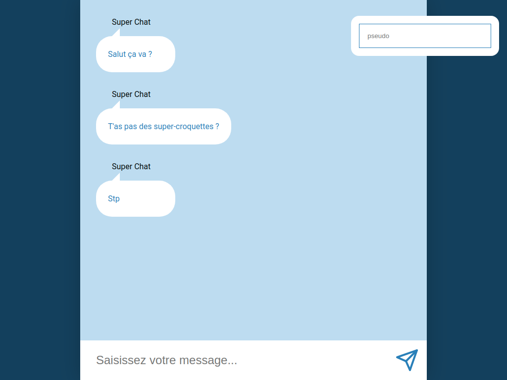
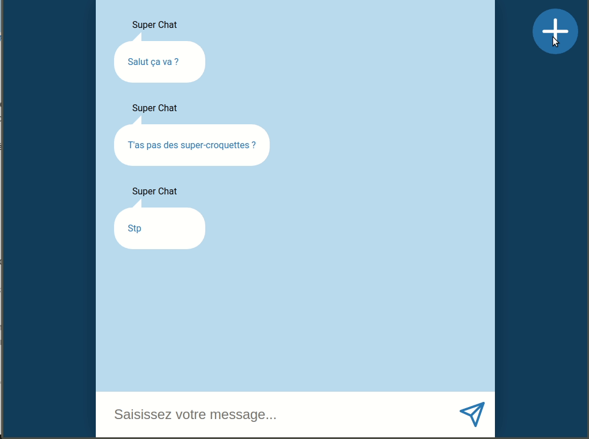

# Chatroom

On va constuire un chat entièrement fonctionnel :scream:  
Pas de panique on va y aller étape par étape, ce soir on commence par pouvoir envoyer un message et à utiliser redux.  
On verra demain pour qu'on puisse nous répondre, tant pis si on parle tout seul pendant quelques temps :smile:

## Résultat

## Styles

Pas d'indications, tu es libre ici de te rapprocher du modèle ou bien de partir au plus simple pour te concentrer sur les fonctionnalités

## Fonctionnalités

On doit pouvoir

- Saisir un message dans le champ du bas
- On doit pouvoir soumettre ce message
- Il doit apparaître dans la liste des messages au-dessus

Bien sûr tu dois utiliser **redux** et **react-redux** pour gérer tes données et tes actions

---

  

    Bonus
  

### Pseudo

On va ajouter un champ pour pouvoir saisir un pseudo

Une fois renseigné les nouveaux messages utiliseront ce pseudo

  

    

      Super Bonus
    

    
### Toggler

On va masquer le champ du pseudo

On ajoute un bouton, au clic dessus le champ apparaît

Si on reclic le champ disparaît

Et ainsi de suite
  

